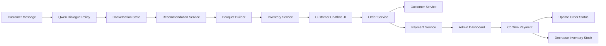

# AI Bouquet Recommendation & Flower Shop Management System

An AI-powered flower shop management system that supports natural-language bouquet consultation, bouquet recommendation, inventory checking, order creation, payment code generation, admin payment confirmation, and automatic stock update.

This project combines:

- Qwen2.5-3B Dialogue Policy
- LoRA / QLoRA fine-tuning
- RAG-based flower knowledge retrieval
- Bouquet recommendation logic
- Inventory management
- Order and payment workflow
- Streamlit customer and admin interfaces
- End-to-end chatbot evaluation

---

## Table of Contents

- [Overview](#overview)
- [Problem](#problem)
- [Solution](#solution)
- [Key Features](#key-features)
- [System Architecture](#system-architecture)
- [Project Structure](#project-structure)
- [Tech Stack](#tech-stack)
- [Dialogue Policy](#dialogue-policy)
- [Recommendation and RAG](#recommendation-and-rag)
- [Order and Inventory Workflow](#order-and-inventory-workflow)
- [Evaluation](#evaluation)
- [Installation](#installation)
- [How to Run](#how-to-run)
- [Demo Flow](#demo-flow)
- [Model Files](#model-files)
- [Requirements Coverage](#requirements-coverage)
- [Limitations](#limitations)
- [Roadmap](#roadmap)
- [Author](#author)

---

## Overview

This project simulates an online flower shop where customers can chat naturally with an AI assistant.

Example customer request:

```text
Cho anh một bó hoa tầm 500k có cẩm tú cầu để tặng người yêu.
```

The system can understand customer requirements, extract important slots, recommend a bouquet, check inventory, create an order, generate a payment code, and allow the admin to confirm payment.

---

## Problem

Traditional flower shop ordering systems often depend on fixed forms and manual consultation.

Common limitations:

- Customers describe requirements in natural language and may provide incomplete information.
- The system does not automatically understand occasion, recipient, budget, color tone, or flower preference.
- Inventory checking is usually manual.
- Bouquet recommendation is not connected with stock and budget constraints.
- Order creation, payment confirmation, and inventory update are often separated.

---

## Solution

This project builds an AI-assisted flower shop management workflow:

```text
Customer Message
→ Dialogue Policy
→ Conversation State
→ Bouquet Recommendation
→ Inventory Check
→ Order Creation
→ Payment Code Generation
→ Admin Payment Confirmation
→ Inventory Update
```

The core idea is to combine an LLM-based dialogue policy with deterministic business logic for recommendation, order, payment, and stock update.

---

## Key Features

| Feature | Description |
|---|---|
| Natural-language chatbot | Customer can request bouquets in Vietnamese using natural language |
| Dialogue Policy Model | Qwen2.5-3B LoRA model predicts intent, action, and slots |
| Conversation State | Tracks occasion, recipient, budget, flower preference, color tone, and customer information |
| Bouquet Recommendation | Suggests bouquet items based on budget, stock, occasion, and preference |
| RAG Support | Retrieves flower knowledge from vector database |
| Inventory Management | Checks stock, price, status, and flower colors |
| Order Creation | Creates an order after customer confirmation |
| Payment Code | Generates payment code and transfer content |
| Admin Dashboard | Admin can view orders and confirm payment |
| Stock Update | Inventory decreases automatically after payment confirmation |
| E2E Evaluation | Includes end-to-end test cases for chatbot workflow |

---

## System Architecture



---

## Project Structure

```text
ai-bouquet-recommendation-system/
├── bouquet/
├── chatbot/
├── customers/
├── dialogue/
├── frontend/
├── inventory/
├── orders/
├── payment/
├── rag/
├── recommendation/
├── scripts/
├── data/
├── notebooks/
├── README.md
├── requirements.txt
├── requirements_train.txt
├── docker-compose.yml
└── .gitignore
```

Main modules:

| Folder | Purpose |
|---|---|
| `bouquet/` | Bouquet building and budget allocation |
| `chatbot/` | Main chatbot pipeline and conversation state |
| `customers/` | Customer storage and update service |
| `dialogue/` | Rule policy, action schema, and Qwen dialogue policy |
| `frontend/` | Streamlit customer and admin UI |
| `inventory/` | Inventory data and stock service |
| `orders/` | Order creation and payment confirmation workflow |
| `payment/` | Payment code generation |
| `rag/` | Flower knowledge retrieval |
| `recommendation/` | Bouquet recommendation service |
| `scripts/` | Dataset generation, validation, training, and evaluation scripts |
| `data/` | Raw, processed, and synthetic datasets |
| `notebooks/` | Dataset inspection and quick experiments |

---

## Tech Stack

| Component | Technology |
|---|---|
| Language | Python |
| UI | Streamlit |
| LLM | Qwen2.5-3B-Instruct |
| Fine-tuning | LoRA / QLoRA |
| Training | TRL, PEFT, Transformers, Datasets |
| Embedding | Sentence Transformers |
| Vector Database | Qdrant / Chroma |
| Recommendation | Rule-based scoring and budget planning |
| Data Format | JSON / JSONL / CSV |
| Evaluation | End-to-end chatbot test cases |

---

## Dialogue Policy

The Dialogue Policy converts a user message into a structured JSON action.

Example input:

```text
Tôi muốn mua một bó hoa tặng người yêu nhân dịp valentine.
```

Example output:

```json
{
  "intent": "new_bouquet_request",
  "action": "ask_missing_info",
  "slots": {
    "occasion": "Valentine",
    "recipient": "người yêu",
    "budget": null,
    "budget_min": null,
    "budget_max": null,
    "budget_type": null,
    "flower_preference": [],
    "flower_avoidance": [],
    "color_tone": [],
    "style": [],
    "delivery_time": null,
    "customer_name": null,
    "customer_phone": null,
    "customer_address": null,
    "order_id": null
  },
  "should_update_state": true,
  "should_recommend": false
}
```

Supported action groups:

| Action Group | Example |
|---|---|
| New bouquet request | `new_bouquet_request` |
| Budget update | `provide_missing_info` |
| Inventory check | `ask_inventory` |
| Flower color question | `ask_flower_colors` |
| Bouquet modification | `modify_flower` |
| Confirm order | `confirm_order` |
| Customer information | `provide_customer_info` |
| Security guardrail | `general_question` |

---

## Recommendation and RAG

The recommendation module uses customer requirements and inventory data to generate bouquet suggestions.

It considers:

- Occasion
- Recipient
- Budget
- Budget type
- Flower preference
- Flower avoidance
- Color tone
- Style
- Stock availability
- Unit price

RAG is used to retrieve flower-related knowledge such as meaning, suitable occasions, and pairing suggestions.

---

## Order and Inventory Workflow

```text
1. Customer receives bouquet recommendation
2. Customer confirms the bouquet
3. Chatbot asks for customer information
4. Customer provides name, phone number, and address
5. OrderService creates an order
6. PaymentService generates payment code
7. Admin confirms payment
8. Order status changes from pending_payment to preparing
9. Inventory stock is decreased automatically
```

Example order state before admin confirmation:

```json
{
  "order_id": "ORD-20260719-0001",
  "status": "pending_payment",
  "payment": {
    "payment_status": "pending"
  }
}
```

Example order state after admin confirmation:

```json
{
  "order_id": "ORD-20260719-0001",
  "status": "preparing",
  "payment": {
    "payment_status": "paid"
  }
}
```

---

## Evaluation

The project includes an end-to-end chatbot evaluation pipeline.

Evaluation covers:

| Test Type | Description |
|---|---|
| Bouquet recommendation | Check if bot recommends after enough information |
| Slot extraction | Check occasion, recipient, budget, and color tone |
| Inventory query | Check stock-related questions |
| Flower color query | Check available colors of recommended flowers |
| Bouquet modification | Check flower/color update and re-recommendation |
| Order creation | Check order ID and payment code generation |
| Security guardrail | Block customer-side payment confirmation |

Run E2E test:

```powershell
python scripts\test_e2e_chatbot.py
```

Analyze failed cases:

```powershell
python scripts\analyze_e2e_failures.py
```

Main evaluation-related files:

```text
data/processed/e2e_chatbot_test_cases.json
scripts/test_e2e_chatbot.py
scripts/analyze_e2e_failures.py
```
Evaluation reports are provided in the `reports/` directory:

```text
reports/
├── e2e_chatbot_test_report.json
├── e2e_failed_cases.json
├── extraction_metrics.json
├── recommendation_sample_result.json
└── sample_predictions.jsonl
These files contain saved evaluation artifacts from model extraction, recommendation testing, and end-to-end chatbot testing.
---

## Installation

Create virtual environment:

```powershell
python -m venv .venv
.venv\Scripts\activate
```

Install dependencies:

```powershell
python -m pip install -r requirements.txt
```

---

## How to Run

### Run customer chatbot

```powershell
python -m streamlit run frontend\streamlit_customer.py
```

### Run admin dashboard

```powershell
python -m streamlit run frontend\streamlit_admin.py
```

Default admin password for MVP:

```text
123456
```

---

## Demo Flow

Example demo conversation:

```text
User: Tôi muốn mua một bó hoa tặng người yêu nhân dịp valentine
Bot : Dạ anh/chị muốn bó hoa trong khoảng ngân sách bao nhiêu ạ?

User: Tầm trên 700k đi
Bot : Dạ em gợi ý cho anh/chị bó hoa như sau...

User: Những hoa trên có màu nào khác không?
Bot : Cẩm tú cầu hiện có các màu/tone...

User: Cẩm tú cầu màu xanh làm chủ đạo nhé
Bot : Dạ em gợi ý lại bó hoa...

User: Ok tôi lấy bó này
Bot : Dạ anh/chị cho em xin thông tin nhận hàng...

User: Nguyễn Viết Anh - 0866660251 - Xóm Trung Tiến, Vinh
Bot : Dạ em đã tạo đơn hàng...
```

---

## Model Files

Model adapter files are excluded from GitHub because of file size.

Expected local path:

```text
outputs/qwen2.5-3b-dialogue-policy-final/
```

Expected files:

```text
adapter_config.json
adapter_model.safetensors
tokenizer.json
tokenizer_config.json
```

To train the final dialogue policy model:

```powershell
python scripts\train_dialogue_policy_qwen_final.py
```

Older extractor adapter files are also excluded from GitHub:

```text
qwen2.5-3b-bouquet-extractor/
```

---

## Requirements Coverage

| Requirement | Implementation | Evidence |
|---|---|---|
| Understand customer request | Qwen Dialogue Policy | Intent/action JSON |
| Track conversation state | ConversationState | Sidebar debug state |
| Recommend bouquet | RecommendationService + BouquetBuilder | Bouquet proposal output |
| Check inventory | InventoryService | Stock and unit price response |
| Answer flower colors | Inventory color field | `answer_flower_colors` route |
| Modify bouquet | Dialogue Policy + Recommender | Re-recommendation after color/flower update |
| Create order | OrderService | `orders/orders.json` |
| Generate payment code | PaymentService | Payment code in chatbot response |
| Admin confirmation | Streamlit Admin | Confirm payment button |
| Update inventory | OrderService + InventoryService | Stock decreases after payment |
| Evaluate flow | E2E scripts | `e2e_chatbot_test_report.json` |

---

## Limitations

Current limitations:

- The system is still an MVP and uses local JSON files instead of a production database.
- Admin authentication is simple and should be replaced with a secure login system.
- Payment confirmation is manual and not connected to a real payment gateway.
- Qwen Dialogue Policy requires local model adapter files that are not pushed to GitHub.
- Recommendation logic is rule-based and can be improved with learning-to-rank or optimization methods.
- Inventory and order services are designed for demonstration, not production concurrency.
- Current Streamlit UI is designed for demo and local testing.

---

## Roadmap

Planned improvements:

- Replace JSON storage with PostgreSQL or SQLite.
- Add real authentication for admin.
- Add payment gateway or webhook integration.
- Improve recommendation scoring.
- Add product images and bouquet preview.
- Add Docker deployment.
- Add REST API with FastAPI.
- Improve Dialogue Policy dataset with more real conversations.
- Add automated CI tests.
- Add a public demo video or screenshots.

---

## Author

This project was developed as a practical AI/ML engineering project for learning and portfolio building.

Focus areas:

- LLM fine-tuning
- Dialogue policy modeling
- RAG
- Recommendation system
- Inventory management
- End-to-end AI application workflow